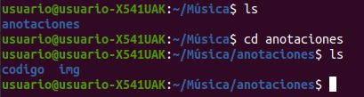
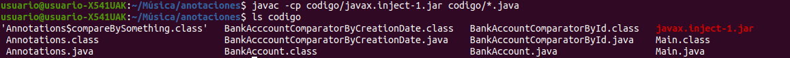
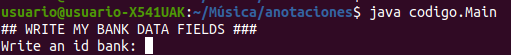
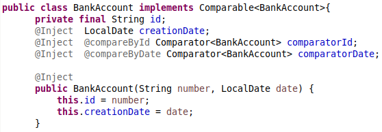
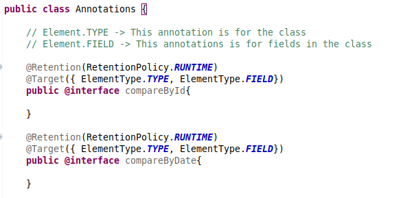
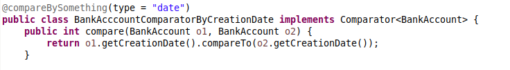
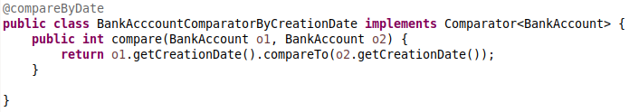

# Anotaciones en Java

## Índice

- Introducción
- Compilación y ejecución
- Explicación del ejercicio

## Introducción

En esta carpeta se presenta el ejercicio de clase correspondiente al uso de anotaciones en Java para especificar inyecciones de dependencias en el código. En este fichero se explicará cómo compilar y ejecutar el código del ejercicio, así como una breve explicación sobre cómo funciona dicho código

## Compilación y ejecución

La estructura del directorio tras descargarlo del github es la siguiente:

carpeta codigos -> aquí encontraremos todos los ficheros .java y la librería de javax.inject necesaria para las anotaciones

README.md -> Este fichero markdown con la explicación sobre cómo compilar y ejecutar

### Compilación

Para compilar el ejercicio, abrimos a terminal de nuestro ordenador y nos situamos en el directorio donde se haya descargado la carpeta del git:

Como se puede observar, dentro de la carpeta Música de mi ordenador, está a carpeta anotaciones, donde dentro de la misma tenemos el código del ejercicio. Para poder compilar y ejecutar el código, debemos de estar en el directorio raiz de git. En este caso dicho directorio raíz se llama anotaciones.

Para compilar el código, una vez que nos hayamos situado en anotaciones, ejecutamos el siguiente comando:

- javac -cp codigo/javax.inject-1.jar codigo/*.java

En la siguiente imagen podemos observar que cuando se ejecuta este comando, se generan los ficheros .class resultantes de la compilación de los ficheros:

### Ejecución

Finalmente, para ejecutar el ejercicio una vez que los ficheros hayan sido compilados, se ejecuta el siguiente comando:

- java codigo.Main

En la siguiente imagen, se observa que se ejecuta correctamente:

## Explicación del ejercicio

Para la realización de este ejercicio se han usado dos anotaciones: 
- Inject
- Anotaciones personalizadas @compareById y @compareByDate

La primera de estas anotaciones (@Inject), le indica al compilador cuando hay algo que debe de inyectarse. Por ejemplo, en la clase BankAccount observamos esto en varias ocasiones:

Se observa que se ha indicado que los atributos comparatorId, comparatorDate y creationDate son dependencias que deberán de inyectarse. En el constructor se inyectará la dependencia para creationDate y en otros métodos (los setters) se inyectarán los de comparator.

Las anotaciones personalizadas nos sirven para representar qué tipo de servicio estamos usando en la anotación (si estamos comparando por id o por date)

Estas anotaciones se usan tanto en las clases BankAccountComparatorById, BankAccountComparatorByCreationDate como en los campos de BankAccount. De esta forma se especifica al compilador qué tipo de comparaciones se van a realizar. 

