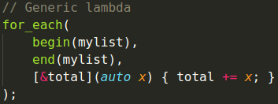
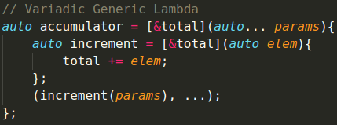
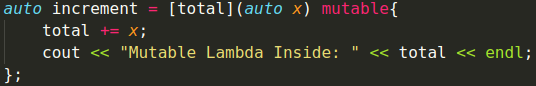

# Indice
- Introduccion
- Compilacion
- Explicacion

## Introduccion
En esta carpeta se presenta el ejercicio de lambdas en el que se expondran 3 ejemplos: **Generic Lambda, Variadic Generic Lambda y Mutable Lambda**.

## Compilacion
```console
g++ -o lambdas lambdas.cpp -std=c++17
```

## Explicacion

### Generic Lambda
Las funciones genericas lamdas son funciones anonimas que cogen valores por valor o por referencia(no es obligarorio) y se le pasan X parametros. En este ejemplo, vemos como para cada valor de una lista, coge la variable total por referencia y se le pasa un parametro. Esta funcion lamda agrega a total cada valor de la lista.



### Variadic Generic Lambda
Este tipo de funciones lambda se diferencia de las anteriores en que no sabe cuantos parametros se le van a pasar. Esta funcion agrega todos los parametros pasdos a la variable total.



### Mutable Lambda
Este tipo de funciones lo que hacen es coger las variable por valor y modificar el valor de este pero solo para el scope de la funcion lambda, una vez fuera mantiene su valor original. 

Para poder modificar el valor de la variable que ha sido pasada por valor, necesitamos el uso de la palabra reservada mutable, ya que las variables por valor son read-only.


