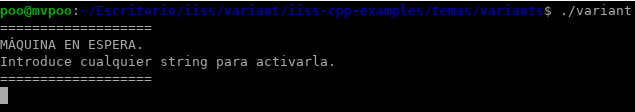
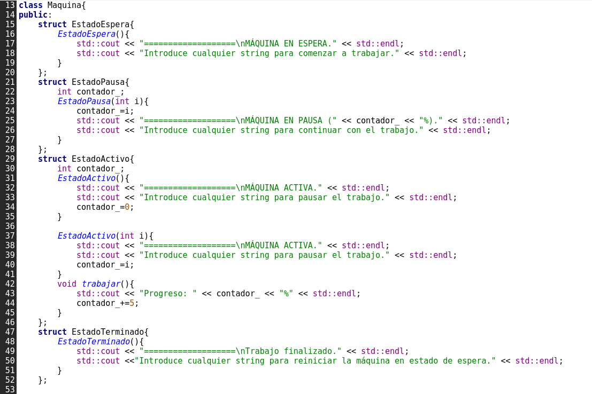
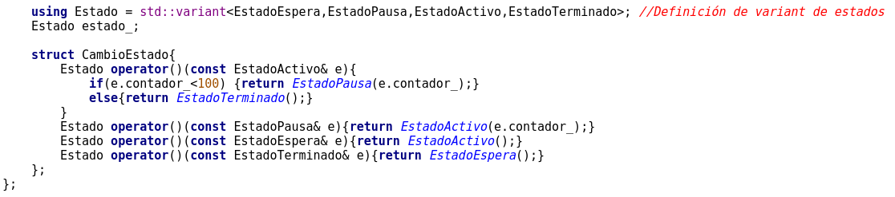
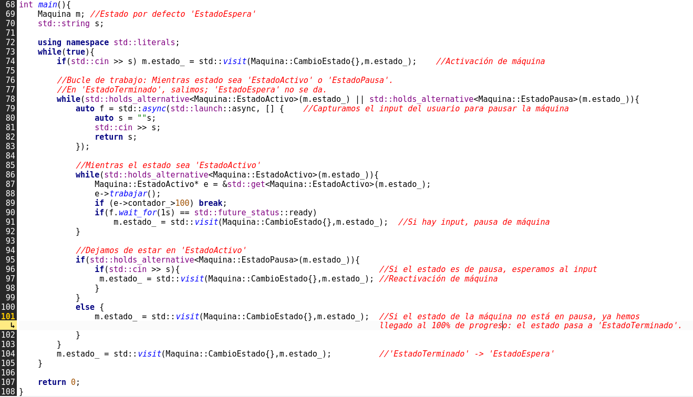

<h1>Variants en C++</h1>
<h2>Introducción</h2>
En este ejercicio implementamos una máquina de estados finitos muy básica mediante el uso de std::variant, ayudándonos también de std::futurey std::async para poder detener 
y activar la máquina.

<h2>Compilación y ejecución</h2>
Para compilar el ejercicio, es tan sencillo como situarnos en el directorio donde se encuentra el fichero variant.cpp y ejecutar el siguiente comando:

Y para ejecutar el ejemplo, ejecutamos la siguiente línea:

Una vez ejecutado el programa, podemos introducir cadenas cualesquiera para cambiar el estado de la máquina.

<h2>Explicación del ejercicio</h2>
Como dijimos anteriormente, en este ejercicio implementamos una máquina de estados finitos con cuatro estados posibles: Espera, Activo, Pausa y Terminado.
El trabajo de nuestra máquina será llevar un contador desde 0% hasta el 100%, avanzando un 5% cada segundo. El usuario podrá introducir una cadena cualquiera por consola para iniciar la máquina, pausarla/reactivarla, y reiniciarla cuando el trabajo haya terminado.

Dentro de nuestra clase Máquina, tenemos definidas las 4 estructuras que representan nuestros estados junto con los mensajes a mostrar al cambiar de estado.
Tanto durante el estado Activo como durante el de Pausa, tenemos un contador con el progreso actual en el trabajo.

Finalmente, dentro de la clase tenemos declarado el tipo Estado como un variant que recoge las cuatro estructuras anteriores, de modo que nuestro Estado puede ser de cualquiera de esos cuatro tipos. Tenemos también una estructura CambioEstado, que contiene una sobrecarga del operador() para cada uno de los cuatro estados posibles y se encarga de decidir a qué estado se pasa desde el estado actual.

En el main, ponemos en uso las funcionalidades. Mediante el uso de std::visit utilizamos los operadores de cambio de estado. Como nuestra máquina por defecto se inicializa
en estado 'EstadoEspera', en la línea 74 pasamos de 'EstadoEspera' a 'EstadoActivo', entrando en el bucle principal del programa. A partir de ahora, mientras nuestro estado
sea Activo o Pausa, significa que nuestro trabajo sigue en proceso. Utilizamos std::future para esperar una cadena del usuario de forma asíncrona mientras se realiza el trabajo.

Luego, en la línea 86, entramos al bucle de trabajo activo. Mientras el estado sea Activo, seguiremos invocando al método trabajar() de EstadoActivo, aumentando así el contador. Cuando dicho contador pase de 100, el trabajo está completo y se sale del bucle. Si el futuro declarado anteriormente se completa, se cambia el estado a Pausa y se sale del bucle.

Una vez fuera del bucle de trabajo activo, tenemos dos opciones: si el estado actual es Pausa, se espera un nuevo input y se cambia el estado. Al ser el contador menor de 100, pasaríamos a estado Activo nuevamente y volveríamos al bucle anterior. En caso contrario, significa que hemos salido del bucle porque el trabajo terminó, y el cambio de estado resulta en EstadoTerminado. Al ser el estado distinto de Activo o Pausa, salimos del bucle de trabajo principal y quedamos a la espera de otra cadena para reiniciar la máquina, pasando de 'EstadoTerminado' a 'EstadoEspera' y volviendo a empezar.
